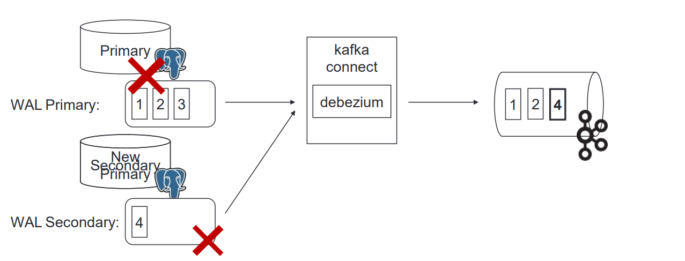
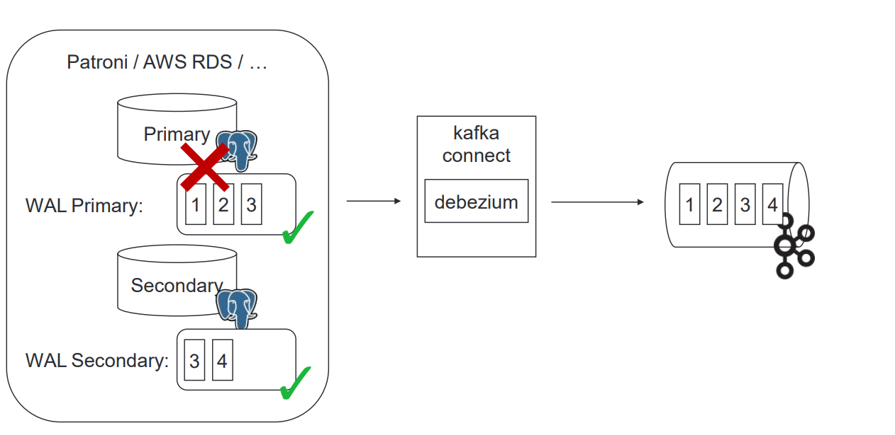

# CDC + Debezium

1. Создаем коннектор
2. Коннектор создает топик и делает туда snapshot данных
3. Данные меняются, транзакция публикуется в WAL лог базы
4. Коннектор читает Wal лог и через десятки ms сообщения уже в kafka

## Нюансы

1. Репликация может быть включена только у главной(Primary)
   ноды
2. Непрочитанные wal логи с primary надо переносить вручную

## Решение

Решается это путем поднятия отказоустойчивого кластера

В этом случае не прочитанный wal лог переписывается на другую ноду

## Нюанс

Debezium ожидает конкретный хост, поэтому нельзя указывать несколько

## Решение

Добавить балансировщки

## Нюанс(риск сломать бд)

Из wal лога данные удаляются после того как они были прочитаны конектором
и если коннектор падает, то логи копятся и бд может упасть

## Решение

Мониторить 24/7, готовый Disaster Recovery plan
