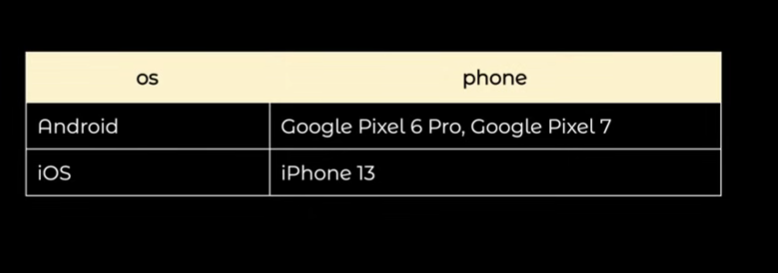
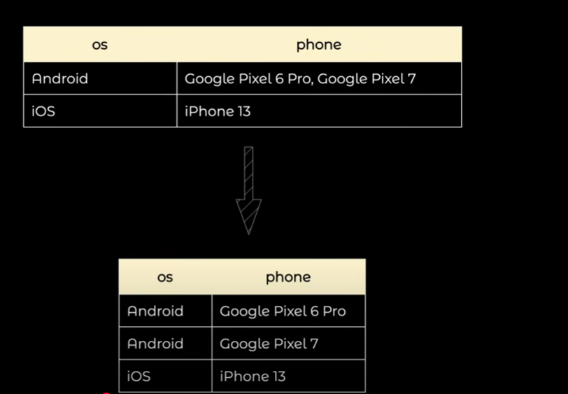
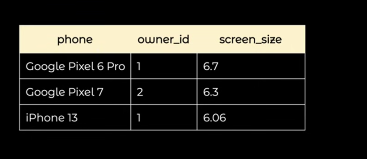
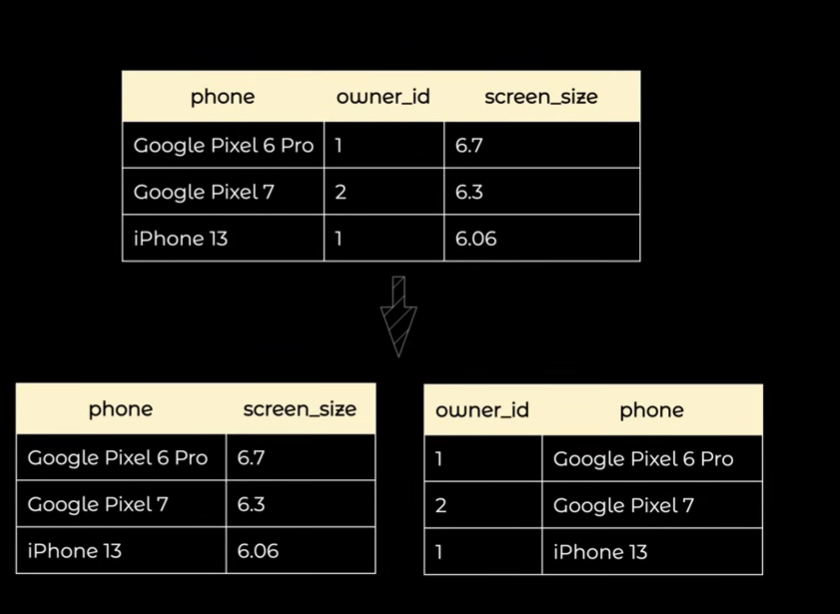
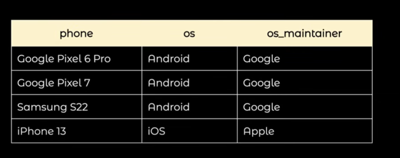
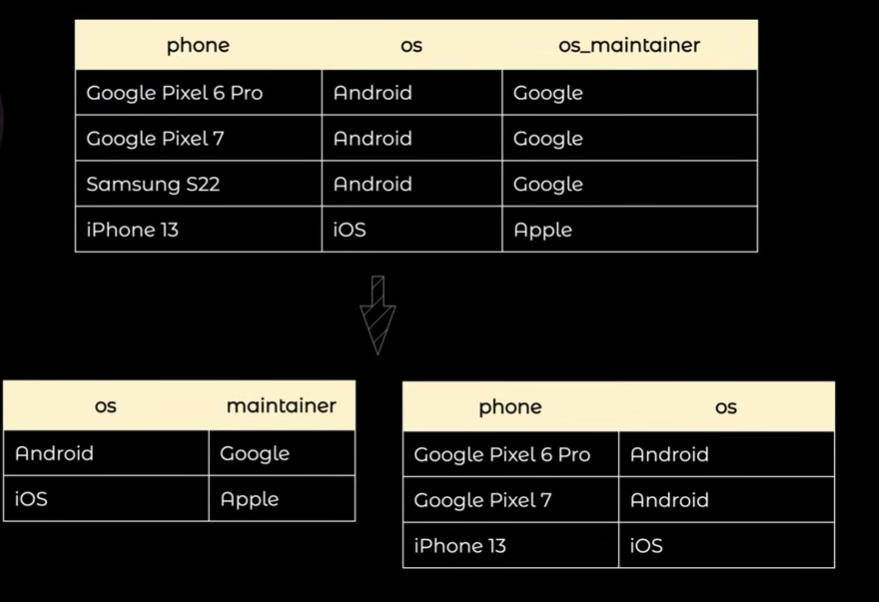

# Нормальные формы

Источники

-   https://www.youtube.com/watch?v=0kq99Y8m0gw

## Виды

-   Первая нормальная форма
-   Вторая нормальная форма
-   Третья нормальная форма
-   Нормальная форма Бойса-Кодда
-   Четвертая нормальная форма
-   Пятая нормальная форма
-   Доменно ключевая нормальная форма
-   Шестая нормальная форма

## Термины

Отношения - таблицы
Атрибуты - поля таблицы
Кортежи - строки таблицы

### Первая нормальная форма

1. Нет дублирующихся строк
2. Все атрибуты атомарны
3. Нет повторяющихся атрибутов с одинаковым смыслом

**Нарушение первой нормальной формы**

**Как правильно**

### Вторая нормальная форма

1. Отношение находится в первой нормальной форме
2. Есть первичный ключ
3. Все не ключевые атрибуты функционально зависят от ключа целиком, но не от его части

**Нарушение второй нормальной формы**

Форма нарушена так как в данном случа у нас первичным ключем может быть два поля
phone и owner_id, а screen_size зависит только от phone нарушается 3 правило второй
нормальной формы

**Как правильно**

### Третья нормальная форма

1. Отношение находится во второй нормальной форме
2. Не ключевые атрибуты напрямую зависят только от PK, но не от других атрибутов

**Нарушение третьей нормальной формы**

Опять же неключевой атрибут привязан не к PK(phone) а к os нарушение 3 правило третьей
нормальной формы

**Как правильно**

