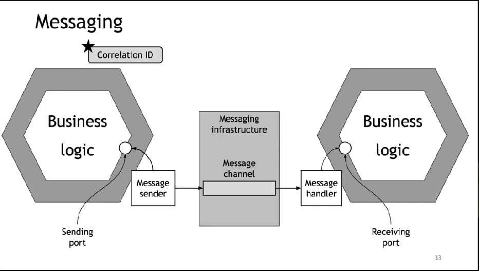

# Шаблоны проектирования для микросервисов

Материалы
Видос [Шаблоны проектирования для микросервисов
](https://www.youtube.com/watch?v=_RCiOo4Dv8w)

## Синхронное и асинхронное взаимодействие

### Синхронное взаимодействие

Плюсы:

1. оно простое
2. не требует промежуточного брокера для времменого хранения сообщения

Минусы

1. одновременно и клиент и сервер должны быть доступны, что снижает доступность всей системы
2. Клиенты должны знать адрес консюмера, тоесть клиент должен знать адрес сервиса к которому он запрос отправляет

### Асинхронное взаимодействие

Плюсы

1. Оно хорошо масштабируется
2. Запросы отправляются не конкретным сервисам, они отправляются в промежуточные хранилища.

Минусы

1. Усложняется обработка ошибок
2. Нельзя угадать сколько времени уйдет на обработку конкретного запроса

## Как сделать синхронное взаимодейтсвие надежным

В центре у нас имеется бизнес логика, для взаимодействия с внешними системами в такой архитектуре предпологается наличие порта, а этому порту добавляется, например прокси, для вызова удаленных процедур.

**Что это означает**
Мы не вызываем напрямую стороний сервис, а есть некоторый интерфейс и за ним спрятана имплементация, иммено эта имплементация в какойто момент и вызывает стороний сервис, иммено этот адаптер отправляет запрос, на другой стороне такой же адаптер принимает запрос.

**Промежуточный слой**

Для чего он нужен:
позволяет легко обрабатывать ситуации частичных отказов
В случае если сервис не доступен то в такой инфраструктуре мы можуем поручить этому прокси и другие обязаности, например реализацию патерна Circuit breaker который позволяет избавиться/избежать частичных отказов

Например если Order service недоступен то мы можем возращать какойто ответ по умолчанию

**Важно**
_Не вызывать код для взаимодействия со стороними системами из кода с вашей бизнес логикой используйте промежуточные прокси_

## Еще пример как синхронное взаимодейтсвие сделать надежным

Запустить несколько инстанцев сервисов

Здесь важно понимать как клиент узнает о динамически запущенных инстансах сервиса.
Тут на помощь приходит патерн Service discovery

### Application-level service discovery

Есть клиент, есть сервер с сервисами и на каждом таком севрисе есть библиотека для service discovery и есть отдельный сервис который service registry
И как только новый инстанс стартует библиотека сразу сообщает service registry о том что стартовал новый инстанс с таким названием и таким ip адрессом
Что такое service discovery - это что то по типу мапки типа Map<string, array> где string название сервиса, а array его инстансы
Если клиент захочет отправить запрос на сервис он сначала запрос на получени всех ip адресов и потом сможет отправить запрос

### Platform-provided service discovery

**service discovery который предоставляется инфраструктурой**

Как только сервис стартует он регистрируется неким регистратором в service registry
и когда сервис хочет обратиться к сервису он обращается по какомуто имени, а инфраструктура обращается к service registry по этому имени и выдает адрес

### + и - service discovery

**Application-level service discovery**
Плюсы

1. Можно развернуть в любой инфраструктуре
   Минусы
1. Нужно самостоятельно заботиться о service discovery
1. Если севрис написан на разных языках, то для каждого языка нужна библиотека service discovery

**Platform-provided service discovery**
Плюсы

1. Делегируете обязаность например k8s, не нужно управлять всем самим

Минусы

1. Ограничены одной платформой

## Асинхронное взаимодействие

### Messaging

Сдесь почти тоже самое что и при синхроном взаимодейсвии, мы также не вызываем на прямую стороний сервис из бизнес логики
